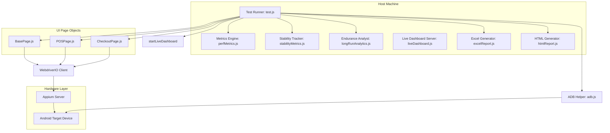
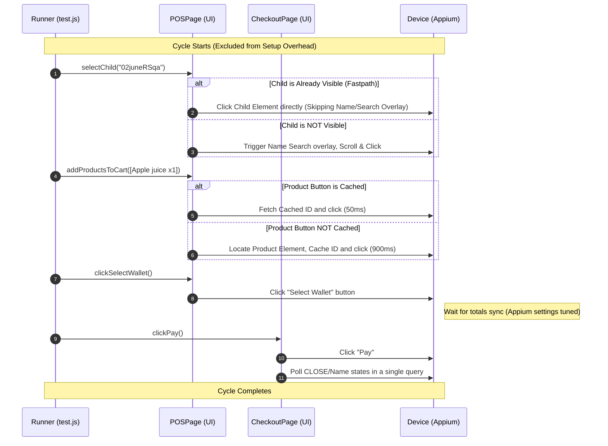

# ParentPay POS Stress Framework — Architecture & Optimization Guide

This document outlines the architecture, component hierarchy, flow control, and performance optimization mechanics of the ParentPay POS Automated Stress Testing Framework.

---

## 1. High-Level Architecture Overview

The POS Stress Framework is a modular automation system built using **Node.js, WebdriverIO (v8), and Appium (v2)**. It is designed to run transaction endurance and load testing against the ParentPay Point of Service Android application (MAUI-based).

### Component Block Diagram

---

## 2. Core Modules & Responsibilities

### 2.1 Test Runner (`test.js`)
* **Role**: The main lifecycle controller.
* **Responsibilities**:
  - Parses configurations and processes runtime command-line arguments.
  - Launches and coordinates the local dashboard server (Port 5050).
  - Handles device selection and performs startup checks (Appium status, ADB link, internet connectivity).
  - Executes the main transaction loop (`shouldContinue` check based on duration or cycle targets).
  - Recovers from crashes, session failures, or watchdogs via clean session pool cycles.
  - Generates the final spreadsheet and HTML visual summaries.

### 2.2 Performance Metrics (`utils/perfMetrics.js`)
* **Role**: Active transaction stopwatch and profiling engine.
* **Responsibilities**:
  - Captures micro-timings for Child Selection, Cart Build, Wallet Ready state, and Checkout Processing.
  - Computes cycle-level statistics, average transaction duration, and estimated orders-per-minute (OPM).
  - Restarts metrics tracking precisely at the loop start (excluding app initialization delays) to provide accurate OPM.

### 2.3 Long-Run Analytics (`utils/longRunAnalytics.js`)
* **Role**: Endurance trend analyzer.
* **Responsibilities**:
  - Detects slowdowns by comparing first-window vs last-window cycle timings.
  - Estimates memory leak signals using linear regression (least-squares slope) over Android heap samples.
  - Implements the **Risk-Based Memory Health Model** to classify client resource health.

### 2.4 Device Controller (`utils/adb.js`)
* **Role**: Hardware-level health gate.
* **Responsibilities**:
  - Regularly pings the device to ensure ADB responsiveness.
  - Monitors application RSS/PSS memory consumption.
  - Resets UiAutomator2 client services when instrumentations hang.
  - Manages keep-awake power settings and handles auto-healing connection drops.

---

## 3. Performance Optimization Mechanics (Rapid Mode)

When `"executionMode": "rapid"` is configured, multiple optimizations activate across the UI layer to bypass default Appium and Android delays:

### 3.1 Child Selection Cache & Fastpath
* **Normal Mode**: Triggers search overlays, types child names, waits for search responses, and clicks.
* **Rapid Mode**: Bypasses the lookup overlay entirely if the previous cycle targeted the same child. If the child is already visible on the main grid, the runner clicks it directly, reducing select times from **1.2s to under 300ms**.

### 3.2 Product Element ID Caching
* **Normal Mode**: Standard locator search (`android=new UiSelector().text("...")`) query sent to Appium server on every tap.
* **Rapid Mode**: Caches resolved WebdriverIO element reference IDs. Subsequent quantity increments or consecutive ordering cycles fetch the cached ID directly. This cuts product addition overhead from **~900ms to ~50ms (94.4% savings)**.

### 3.3 Dynamic Appium Settings Tuning
* Sets `waitForIdleTimeout: 100` and `actionAcknowledgmentTimeout: 0` to prevent WebdriverIO from blocking during layout transitions or cart sync animations.

### 3.4 Adaptive Scroll-Search Bypass
* Bypasses the default 2.4s element retry loops inside `BasePage.js` scroll paths when an element is not immediately visible, triggering direct viewport scrolling without static delays.

---

## 4. Diagnostics & Memory Health Classification

The framework monitors memory trends utilizing PSS heap dumps (`adb shell dumpsys meminfo`) and categorizes memory risk using a 4-tier model:

| Status | Trigger Condition | Classification | Action/Recommendation |
| :--- | :--- | :---: | :--- |
| **Healthy** | Slope < 0.25 MB/cycle AND no slowdown or failures | Low Risk | No action needed. |
| **Memory Growth Observed** | Slope 0.25 to 0.75 MB/cycle AND no significant slowdown / stability failures | Low Risk | Standard framework/caching growth; extend test duration if verifying long-term limits. |
| **Potential Memory Retention** | Slope > 0.75 MB/cycle AND (slowdown detected OR slowdown > 10% OR recoveries/restarts occurred) | Medium Risk | Heap analysis recommended to inspect target page retention. |
| **High Risk of Memory Leak** | Slope > 1.5 MB/cycle AND (slowdown > 20% OR app restarts OR repeated recoveries OR fatal failures) | High Risk | Instability detected; detailed dump analysis strongly recommended. |
