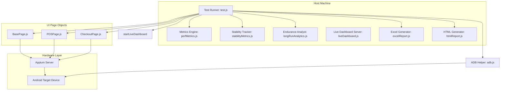

# ParentPay POS Stress Testing Framework

A modular, automated endurance and load testing framework built for the ParentPay Point of Service (POS) Android application using **Node.js, WebdriverIO (v8), and Appium (v2)**.

---

## 1. Project Overview & Problem Statement
Automated stress testing of mobile POS applications presents unique challenges:
* **Connection Instability**: Appium/ADB sessions frequently drop or freeze during long-duration runs.
* **Memory Leakage**: Native/hybrid mobile components (such as MAUI-based elements) are prone to heap accumulation.
* **Popups & Modals**: Unhandled network/session alerts can halt execution queues permanently.

This framework is built with a **recovery-first philosophy** to run unattended endurance loops (e.g., 4h/8h/12h runs) while continuously self-healing, classifying memory risks, and capturing fine-grained performance metrics.

---

## 2. Technology Stack
* **Runtime**: Node.js (v18+)
* **Automation**: WebdriverIO Client (v8+) & Appium Server (v2.x)
* **Device Communication**: Android Debug Bridge (ADB)
* **Reporting**: ExcelJS (Spreadsheet generation), Socket.io & Express (Live Dashboard)

---

## 3. High-Level Architecture Overview
The framework consists of a control loop that coordinates UI page objects, metrics collectors, device-level recovery agents, and real-time dashboard endpoints.



For a comprehensive deep-dive into each module, see [Architecture Guide](file:///d:/POSStressTest/docs/Architecture.md).

---

## 4. Key Features
1. **Self-Healing Recovery**: Watches for Appium timeouts, ADB connection drops, or UI Automator hangs, and proactively teardowns, reconnects, and restores state.
2. **Performance Micro-Timings**: Measures and records checkout step durations (Child Selection, Cart Build, Wallet Ready, Payment Processing).
3. **Execution Modes**:
   * **Standard**: Mimics natural human clicks and scroll settle timings.
   * **Rapid**: Bypasses overlays, caches element IDs, and tunes Appium timeouts for maximum orders-per-minute (OPM).
4. **Endurance Analytics**: Tracks memory growth via ADB heap dumps, runs linear regressions, and applies a **Risk-Based Memory Health Model** to detect memory leaks.
5. **Live Dashboard & Reporting**: Exposes a real-time web portal (Port 5050) and generates HTML/Excel summaries at the end of each run.

---

## 5. Folder Structure
```
d:/POSStressTest/
├── .agents/            # AI assistant constraints (Copilot, Codex, etc.)
├── docs/               # Detailed documentation guides
├── pages/              # Page Object Model pattern
│   ├── BasePage.js
│   ├── POSPage.js
│   └── CheckoutPage.js
├── utils/              # Metrics, adb helper, and reporting generators
├── test.js             # Main execution loop
├── benchmark.js        # Benchmark execution tool
├── config.json         # User runtime configuration settings
└── locators.json       # UI element selectors
```

---

## 6. Installation & Quick Start

### Prerequisites
* **Node.js** (v18+)
* **Android SDK Platform Tools** (ensure `adb` is in your environment PATH)
* **Appium Server** (v2.x) and **Java SDK** (v8+)

### Step 1: Install Dependencies
```bash
npm install
```

### Step 2: Start Appium Server
```bash
appium --port 4723
```

### Step 3: Configure `config.json`
Specify your device UDID, execution mode, and test data in `config.json`. Refer to the [Configuration Guide](file:///d:/POSStressTest/docs/Configuration.md) for parameter details.

### Step 4: Run the Framework
Run the main stress loop:
```bash
node test.js
```

Or use npm scripts:
```bash
npm run stress
```

Run the independent functional regression suite:
```bash
npm run functional-regression
```

Or run the benchmark to compare standard and rapid modes:
```bash
node benchmark.js
```

---

## 7. Reports & Dashboard
* **Live Dashboard**: Automatically opens on `http://127.0.0.1:5050` (if configured) to display OPM, cycle statuses, and active events.
* **HTML Summary**: Saved under `reports/` with rich metrics visualization charts.
* **Excel Metrics**: Detailed transaction logs saved under `reports/` for spreadsheet analysis.
* **Functional Regression Reports**: Saved under `reports/functional-regression/` and kept separate from stress metrics.

Functional regression architecture and usage details are documented in `docs/FunctionalRegression.md`.

### Dashboard Preview


---

## 8. Troubleshooting & Diagnostics
If Appium cannot connect or the device goes offline:
1. Ensure `adb devices` lists the device as `device` (not `offline` or `unauthorized`).
2. Run `adb reconnect` to reset target connectivity.
3. Check the [Troubleshooting Guide](file:///d:/POSStressTest/docs/Troubleshooting.md) for more details.

---

## 9. Future Roadmap & Tech Debt
Known areas of framework improvements, memory trends verification, and CI/CD integration are cataloged in [TECH_DEBT.md](file:///d:/POSStressTest/docs/TECH_DEBT.md).
